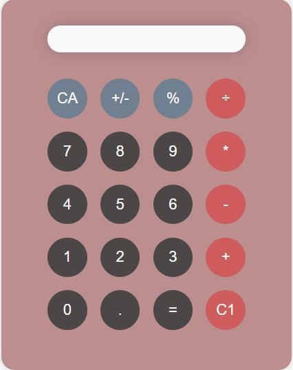

**About** 

This calculator is developed using JavaScript, HTML, and CSS(SCSS) as the second project of the software development course by _Nology.

The comments in the main.js file explain the approach taken to build the calculator step-by-step. At the end of the code, there is a summary of steps taken to approach the problem. It also lists the problems encountered during the process and the steps taken to fix them.

**Operations** 

The calculator performs the following operations on any two values (integer or decimal) at a given time:
1. Addition (+)
2. Subtraction (-)
3. Multiplication (*)
4. Division (÷)
5. Percentage (%)
6. Change sign of either value from negative to positive (or vice-versa) (+/-)

If an operator is added while another exists on the display-bar, the existing operation is performed first.

The CA button clears all the values in the display-bar, and C1 button removes one digit at a time.

If the decimal button is clicked when a value already has a decimal, it does not add an additional decimal to it.

If an operator is clicked before a number, the message "Please enter a value first" is displayed on the display-bar

**The display looks like this:**

_The design is responsive to devices of various sizes._

**Steps to be taken to make it better:** 

1. To make it take multiple values and operators together and solve them using BODMAS.
2. To limit the number of digits that can be added to a number.
3. To round off values to two digits after the decimal point. Currently, it displays as many digits as possible.
3. To display an error message if a number is divided by zero. At present, the answer comes to infinity.
